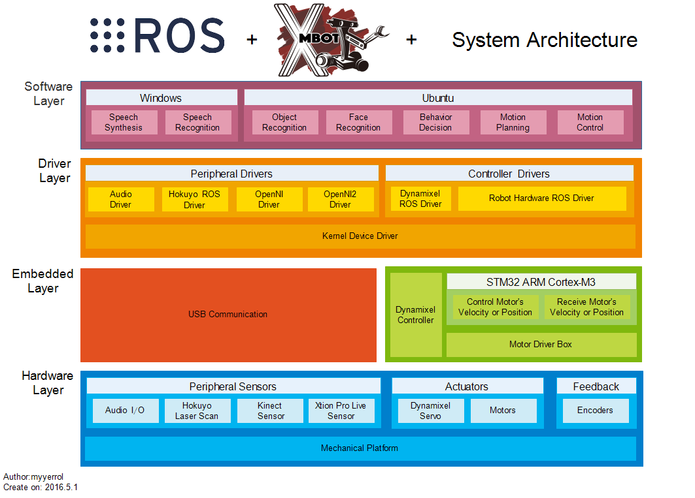
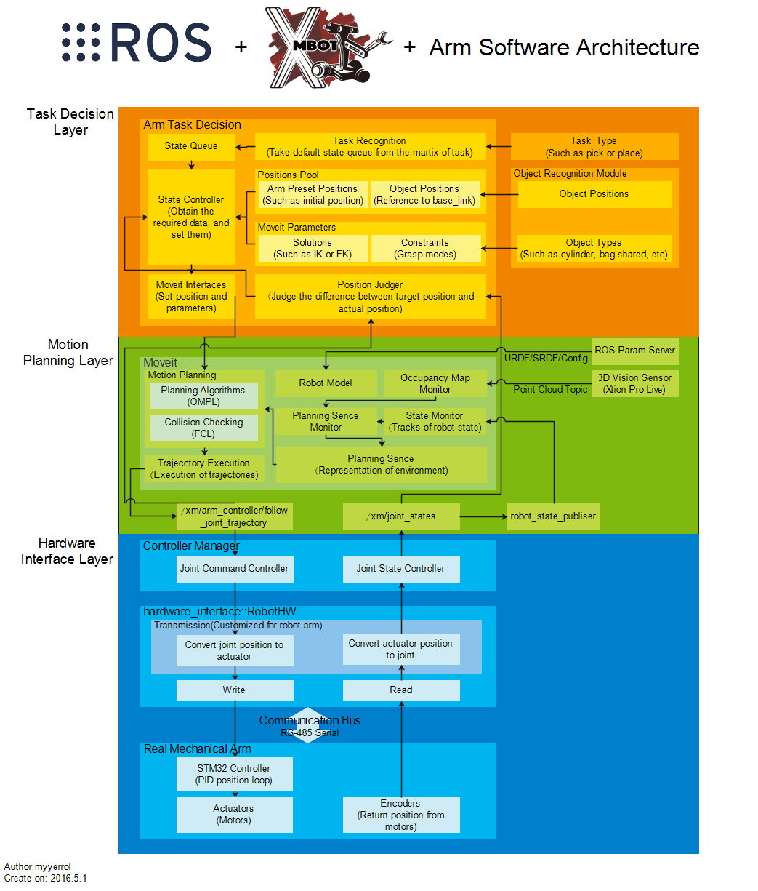

# 晓萌机器人团队开发者经验总结

## 前言
这篇文章确实不短，我不知道各位有没有足够的耐心来看完这篇文章。但是，可以肯定的是，这是我最后写的有关晓萌的文档了。之前，我有在GitHub上更新自己的ROS开发日志，也有我这几天刚上传到GitHub组织中的晓萌机器人团队开发指南。虽然它们的内容并没有多高深，但确实有足够的指导性，当然本篇文章也一样。<br>
首先解释一下，这篇文章本来应该在去年年底就应该完成的，但是我成功地被自己坑了，而且被坑得半死不活的。不过，好在这学期我从坑里面爬了出来，所以才有了足够的时间来完成这篇有关于我在晓萌机器人团队开发的经验总结。好了，切入正题。我写这篇文章的动机其实很简单：因为之前我在加入基地的时候，曾经看过学长写的经验总结。当时最触动我的并不是那些看不懂的概念或者高大上的术语，而是传承。当时，我就想，如果到了我要离开的时候，我也要把自己的宝贵开发经验留给后来者。现在。我总算是有了这个机会。最后，我不废话了，只希望新队员也要谨记在你离开的时候留下你最有价值的东西，哪怕只有很少的一些。

## 技术简介
首先，我大概介绍一下，我们这一届晓萌机器人团队的系统架构，以下是架构图：



晓萌机器人的架构主要分为4层，分别为硬件层、嵌入式层、驱动层和软件层。<br>
1、硬件层的话主要是各种传感器、执行器和编码器，当然，肯定也少不了机械组的一份功劳（稳定且精确度还可以的机械平台）。总之，硬件层最重要的还是底盘和机械臂。机械臂是上一届学长设计的，使用效果很不错。整个机械结构是由同步带和很多同步齿轮组成的，虽然有时会出现同步带松动导致机械臂位置到达不准的情况。但总的来说，这个机械臂不管是从可以接受的载荷还是位置精度上都算很好了，可以说是本届团队相较于之前最抢眼的地方。<br>
2、硬件之上是嵌入式层，不过这可和我之前自己搞的基于树莓派的研究差远了。STM32作为下位机的主控，主要的任务是负责将软件组通过RS-485传过来的数据进行解析，并且以最快的速度传递给接有驱动盒的电机来实时地控制底盘和机械臂。同样的，通过电机编码器返回的数据可以用来计算底盘的里程计，并用作ROS中move_base的输入并配合激光或深度图像传感器来做机器人的自主定位和导航（SLAM）。机械臂在做运动规划的时候，也需要每个机械臂关节的实时状态。总之，嵌入式层就是整个电路的大脑，非常重要。其他的我也扯不了太多了，毕竟我没玩过。以后，我会花时间好好研究研究的。<br>
3、嵌入式层之上就是很好理解的驱动层了。想必大家也都知道，没有驱动，设备就不可能被操作系统所识别，当然也就谈不上使用了。架构图里的驱动层内部其实是分为两个部分的：一个是操作系统内部支持的驱动，可以显示在设备列表里的，我把它叫做硬驱动。另一个就是软件开发者所提供的，可以启动设备的驱动，我把它叫做软驱动。之前我在使用USB2Dyanmixel来控制机械臂手爪的时候，就遇到过硬驱动没法被Linux系统识别的问题。当时，我在其他队员的机子上也试了很多次，发现有的电脑直接就可以识别出/dev/ttyUSBx，而有的跟我一样也不行。我当时就很奇怪，同样是Ubuntu14.04，咋结果不一样呢？后来，我搜索了一段时间Google之后，总算是在一个不起眼的地方找到了问题的解决办法了。问题的原因是系统内核在插入设备的时候没有自动地加载FTDI串口驱动，所以解决的办法是：

```bash
$> sudo modprobe ftdi_sio
$> sudo -s
$> echo 0403 0000 > /sys/bus/usb-serial/drivers/ftdi_sio/new_id
```

注意**0403 0000**是USB2Dynamixel设备的设备号，可以通过lsusb命令来查看。总之，之后如果有哪位新队员遇到了这个问题，希望这段内容可以成为不错的解决方案。<br>
4、最后，终于到了晓萌机器人团队最核心、最具有智能化的部分——软件层。大家可以很清楚地看到，我们使用了两个操作系统平台来实现我们的算法。在Windows上，主要跑的是语音识别，使用的是微软家自带的Speech库。而在Ubuntu上，我们全部使用ROS来做模块的开发和集成。至于Windows和Ubuntu之间的通信，使用的是学长写的Winsocket代码。接下来我主要讲的是机械臂的软件模块，但是与上面不同的地方在于，以下机械臂的软件架构是代表最新一代的。如果有人要问为什么不用第一代机械臂的软件架构来讲，那我只能告诉你我的那一代机械臂架构比较简单，没有什么高大上的东西可以讲。好了，废话不多说，先直接上图：



可以从架构图很清楚的看出，晓萌机械臂在软件层主要分为三个大部分：从下到上分别为硬件接口层、运动规划层和任务决策层。<br>
（1）、硬件接口层其实没有什么好讲的，因为这一部分ROS官方的ros_control已经讲得很清楚了，而且这部分的图我也是基本参照ROS大师Dave Coleman的架构图画的。由于我们的机械臂是由同步轮带驱动的，所以它不是刚体，每个关节位置的改变可能会影响与其连的一个或若干个关节位置，所以在设计关节与电机转换部分时必须考虑电机从动的补偿。<br>
（2）、硬件接口层之上是运动控制层，这一部分我们使用的是MoveIt!的那一套，概念什么的我不想讲了，只是大概说一下。因为关于MoveIt!方面的资料相对较少，所以要想把MoveIt!的API玩好，还是多看看别的机器人是怎么做的，比如pr2_moveit就是一个非常值得研究的例子。<br>
（3）、任务决策层是我最想说的，因为这个我们之前没有，是我对新一代（确切地说是第二代）机械臂架构的一种探索。任务决策层的主要任务是对已有机械臂模块的进一步封装，即把所有与机械臂相关的软件细节都封装起来，最后暴露给外面的只有数据和任务接口。这样做的好处是可以大大降低模块与模块之间的耦合性，并且减少了不必要的进程通信开销，提高了程序运行时的效率。对比一下，之前晓萌的机械臂是没有任何封装的，各种数据就直接在模块之间飞来飞去，而且机械臂模块与决策模块之间定义了很多的action接口，但是其中有很多都是冗余的。所以为了改变这种情况，任务决策层是非常必要的。任务决策层的原理核心是在其内部定义了一个小型的状态机，并且可以根据不同的状态来选择不同的数据发送给运动规划层。举一个例子来详细地说明其整个工作的流程：首先决策模块给机械臂模块发送了一个pick状态，任务决策层收到之后会在状态表中查找，匹配pick状态之后，就把表中的状态链取出并放到状态队列中。每次状态控制器会根据状态队列中的相应状态来分析其所需要的数据。比如，pick状态可以拆分成很过很多子状态：初始态、准备态、抓取态、手爪张开态、手爪夹紧态、拿着物体态等。此时，如果队列中第一个状态是初始态，那控制器就会从机械臂位置池中取出位置，并且从MoveIt!参数表中取出所需的数据，最后通过使用MoveIt!接口把规划的目标发送给运动规划层。机械臂到达位置后，程序会比较目标与实际位置的差值，如果误差小于某个值，便会返回成功给控制器，控制器继续执行下一状态，直到整个状态队列中的状态都被执行完。否则终止程序执行。OK，以上就是我对机械臂封装的个人理解，如果有什么问题，欢迎指正。

## 成果
我们这一届晓萌机器人团队所完成的成果主要由以下几个方面组成：<br>
1、从机械层面上来说，我们相比于之前，有了不少的改进。首先是底盘的四周用隔板做了简单的封装，基本上从外面看不到里面的那些混乱的、缠绕在一起的电线。之后是使用了合适的铝型材来固定显示屏、工控机和麦克风。当然，还有两个最重要的改进。其中一个是搭建在机械臂升降台上的Kinect，有了它，在做物体识别时就很轻松了。另外一个重要改进就是机械臂的手爪了。前一代手爪是那种可以对称张开闭合的结构，而现在使用的是平行结构，即两个金属滑块可以通过在滑轨上对称平行的移动来完成抓取操作。而且除此之外，手爪的内侧还特别加装有塑料海绵，可以保证在不失舵机扭矩的前提下，尽可能地夹紧物体。<br>
2、电子层面上，主要的成果应该算是机械臂的控制了。相比于之前的底盘电机的速度闭环控制，机械臂控制使用的是位置闭环。抛开机械上的误差之外，在控制机械臂的位置精度上电子组做得还是很不错的。除此之外，还有自行设计的基于STM32的控制板，虽然用在晓萌身上出现过不少的问题，但不得不说，这确实是一个非常棒的尝试。<br>
3、软件层面上，我按照模块一一叙述。<br>
（1）、首先是语音模块，用的主体虽然还是之前Windows上的那一套，但在软件的界面和识别的精度上都有了很大程度的提高。我记得去年十月份贵阳比赛的时候，我们在语音测试这一个单项中做到了15个测试用例识别出了13个的好成绩。虽然有的队全部识别正确，但是对于我们来说能在那样的环境下做到这样已经很不错了。<br>
（2）、接着是图像模块。图像模块的改进主要体现在物体识别上吧。因为之前想用的是和MoveIt!集成在一起的ORK，但经过上一届搞图像的学长的研究发现，ORK很难配置起来，而且也不是很好用。所以，这一届我的两个队友非常给力地完成了第一代的物体识别算法，识别的效果经过测试还是非常不错的。基本上Kinect距物体的角度和距离调整得合适的话，架子上每一层的物体差不多都可以识别的到。<br>
（3）、底盘模块的成果主要是添加了机器人自主进门以及更加鲁棒的SLAM。当然，对于BSR项目来说，基于Kinect定制的视觉SLAM也算是不错的成果吧。<br>
（4）、机械臂模块的成果其实是很显而易见的，我们做到了晓萌机器人团队自创立以来第一次的机械臂自主抓取。尽管在运动控制以及策略的制订上还存在明显的不足，但可以肯定的是，未来的继任者可以比我们做得更好。<br>
（5）、最后是整个晓萌机器人的策略模块。放到最后才讲是因为它的确很重要，它可以说是机器人的大脑，也是整个机器人核心智能的体现（虽然我们还远远没有达到）。策略模块的成果主要是根据所要测试的项目添加了对应的状态机控制，这样就可以通过调用以上不同的模块来让机器人自主完成不同状态下的任务。<br>
4、其他层面上，我们的成果还有以下几个方面：<br>
（1）、搭建起来了晓萌机器人团队的GitHub代码管理系统，可以按版本管理老代码和新代码。<br>
（2）、拥有了一套比较完整的软件开发指南，主要用于规范地进行软件的开发。<br>
（3）、拥有了属于我们自己团队精神的Logo、海报和队服。

## 问题
1、机械层：<br>
（1）、首先要提的就是机械臂复位问题。现在每次初始化都要在先断电的情况下人工地将沉重的机械臂水平掰直，然后才能上电复位。虽然这相比于最早使用的限位开关要精准的多，但看起来还是很怪。我想造成这个问题的原因应该是跟我们机械臂的设计有关。机械零点就设置在那样的位置上，想改动也很难。所以希望新成员看看这个地方有没有可以改进的地方。如果实在不行，就还用手动复位，毕竟这也是咱们机器人的一大特色。<br>
（2）、第二个问题主要是关于机械臂手爪的。现在控制手爪舵机的方法是由软件组直接通过串口发送舵机旋转所需要的角度，而角度的计算则是根据物体的宽度通过解算得到的。虽然我们只要把误差拟合一下，就可以使舵机多次做到抓紧物体而又不会过载，但是本身这种方式就不是很科学。因为，我们不能绝对保证手爪每次都能到达物体的相同高度，对于那些是等宽圆柱体的物体来说，我们现在使用的这种纯通过计算的方式没有太大的问题。但对于不等宽的圆柱体来说，这么做很有可能会导致手爪抓得要么太松，抓不住。要么手爪抓得太紧，舵机过载失去扭矩。我认为解决的最好办法就是在手爪上装个压力传感器，并预先根据舵机可以承受的最大过载设定一个安全的压力阈值，这样每当抓一个物体的时候，不管它是什么形状，都可以比较好的完成抓取的操作。<br>
2、电子层：<br>
（1）、问题主要是有太多裸露的电线，这样既不美观，也很影响机器人的调试工作。之前，我们在调试机械臂的时候就曾出现过升降电机的线被底盘缠住，在升降复位上升的过程中直接将其扯断的悲惨经历。希望，之后的电子组成员可以在布线这个问题上多考虑考虑，看看怎样才能像其他队伍那样把线布的既方便使用又能简洁美观。<br>
（2）、机械臂关节移动的正方向比较混乱，希望电子组之后统一方向为：向上为正、向右为正。即软件组发送关节数据为正时，机械臂关节要向上或向右动才行。<br>
3、软件层：<br>
（1）、在启动了底盘和机械臂的robot_hardware，并同时通过串口给下位机发送数据的时，串口总是会出现莫名其妙的崩溃问题。当时我和搞底盘的队友商量之后的解决办法是写一个service来切换底盘和机械臂的模式，这样就保证每次只有底盘或机械臂在给串口发数据。虽然这样做可以，但它并不是一个很好的解决方案。我认为问题的原因应该和串口发送接收队列有关。RS-485串口的波特率已经达到了我们所能使用的极限了，所以要修改的话，应该在软件组代码中给发送或接收队列进行适当的延迟，以抵消大量的数据对数据线路的冲击。<br>
（2）、我之前在研究调用MoveIt!做机械臂逆解时，总会出现解算不成功的问题。后来我们简化了机械臂的控制，并没有在机械臂中用到MoveIt!。希望后来者能够解决这个问题，使晓萌的机械臂控制更上一层楼。

## 规划
1、希望机械上可以减轻升降台的重量，因为搞底盘的队友曾经抱怨沉重的升降台使得他的底盘在导航的时候跑的不够稳当了。还有就是对于BSR项目底盘的设计，希望可以向中科大和上交学习，尝试地使用两轮驱动。因为两轮驱动的话，底盘过门槛是没有问题的。而且底盘电机可以承受的重量也要在设计的时候好好考虑，毕竟负重越重，得分所乘的权值越大。<br>
2、希望软件组各个模块的负责人可以在已有学长学姐的技术积累之上，让模块本身做得足够稳定。我知道虽然我在这里讲的很容易，但真要实现起来，对于我们本科生来说，确实也不容易。但我们不相信自己还能相信谁呢？就像之前我们的学长告诉我们的那样：如果各位不做，西工大就再也没有人去做了。时代把任务交给你们，你们就必须肩负起这个使命。所以为了晓萌机器人项目的发展，希望每届项目组的成员都要做出自己应有的贡献。<br>
3、最后，我的个人愿望就是希望我能在大四本科毕业之前，看到晓萌机器人自主完成GPSR项目，或者至少能够去大超给别人秀一把咱那吊炸天的机械臂。虽然愿望很美好，但到底能不能完成，还要看继任者了。

## 文档
我知道有很多人喜欢编程，不喜欢花时间来写文档（首先阐明一下，这里的文档指的是广义上的文档，即包括图片、视频、文字、架构图等）。但我不得不说，文档对于一个项目的发展是至关重要的。去年，我们十月贵阳比完赛之后，我们组的ROS大牛学长就曾告诉过我：只要晓萌的技术方向没有问题，经过一段时间的发展，我们超越除中科大之外的其他队是没有问题的。我想，相比于代码来说，整个晓萌团队的技术架构、需求设计才最为重要。而往往新架构的设计要花费很多时间，而且还可能需要组内各个模块负责人之间要相互讨论、统一意见。总之，我想说的是我真的很不希望在若干年之后看到：我们拿不出曾经调试或比赛的照片来告诉新成员曾经几代的晓萌长什么样子；我们拿不出合适的视频来证明我们曾经在调试或比赛的时候也完成过某项测试；我们拿不出曾经设计严谨的架构图或技术文档来指导学弟学妹未来晓萌该如何前进和发展。所以为了下一代的发展，我觉得我们应该把我们已有的技术、经验、成果、和对未来的规划以纸质文档、照片、视频等方式永久地记录下来，这样在过了几代发展之后，晓萌机器人才能以一种增量式开发的成果展现在人们的面前。

## 个人总结
毕竟在基地呆了快一年半了，自己的收获还是有很多的。首先我很幸运自己能有机会在本科阶段就加入到这样一支强大的团队中来，而且还能做我自己喜欢做的东西。当然，我觉得最重要的是我体会到了什么才叫真正的团队。回顾以往的开发经历，我们也曾遇到过人员流失等种种困难，但团结一心使我们最终坚持到了现在。多少个周末、寒暑假，别人在放松休息的时候，我们在埋头为晓萌团队的发展贡献自己的力量。我也记不清赛前我们到底熬了多少个昼夜，为比赛项目测试了多少次，但有一点是值得肯定的，我们能够彼此不懈努力并为此拼命的最大动力只来源于学长曾经教导过我们的一句话：绝对不能坑自己的队友。其实有很多人都不理解我们，说我们比赛名次不是很好，拿的奖也不是国际奖，为什么还要牺牲那么多的时间或者有时还要冒着挂科的巨大风险来去做这些东西。其实我想说的是，奖这个东西往往不代表能力，或者说奖不能完全体现出我们的真实水平。就像学长曾说过的，奖只能证明你曾经经历过，只有你自己知道你配得上还是配不上这个奖。总之，在经历过三次比赛之后，我开始慢慢意识到也许奖真的不那么重要，重要的是我们可以用我们的能力来陪伴并见证晓萌的不断成长。有收获，就不遗憾了。<br>
对于我个人来说，坚持到现在，总算是基本完成了任务。未来我想自己必须要多花一些时间来研究理论，因为如果你只会调别人的API，你是很难有非常大的进步的。只有掌握了最核心、最基础的理论知识，才可能在未来创造出令别人刮目相看的东西。<br>
最后，我想说的是：做你最想做的事情，并且为之奋斗下去，永不后悔！
